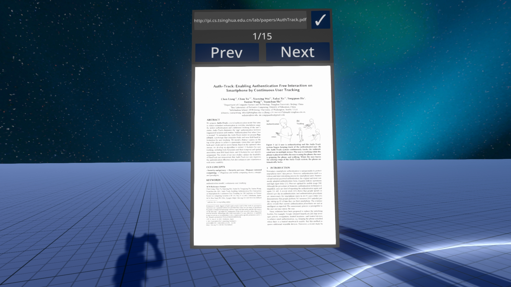

# Resonite PDF Reader Backend
Note: since Resonite now supports reading PDF files natively, this project will now be archived

This is a backend server designed to be used with a PDF reader I created in the [Resonite Metaverse](https://resonite.com/).
The server takes a url of a PDF (or a file), converts it to PNG, and serve it to the PDF reader.

The server works by taking in a PDF file, converts it using `pdftoppm` command, then serve the images converted. Upon completion of conversion, the server will respond with emap, which is a format that can be used in Resonite.

The Resonite side will accept the emap, converts it to variables, then access the images from the server according to the data in the emap received.

